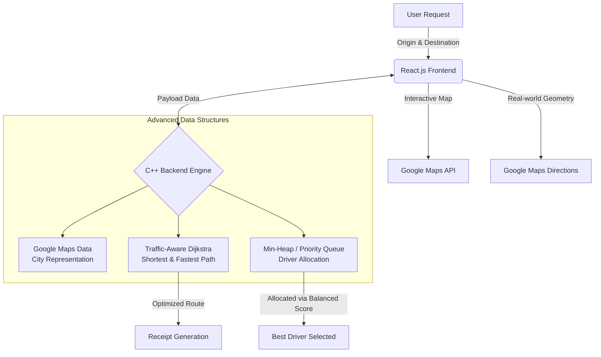

<div align="center">
  
  
  
  
  
  <h1>🚖 Pune Ride Allocation System</h1>
  <p><b>A High-Fidelity Logistics & Pathfinding Engine bridging C++ Algorithms with Modern Web Technologies.</b></p>
</div>

---

## 📖 Project Objective
The Pune Ride Allocation System goes beyond standard navigation—it's designed to solve the **"Matching Problem"** in modern logistics. It answers a critical urban question: *Which driver should be assigned to which rider to maximize efficiency, minimize wait times, and optimize city-wide traffic flow?*

This project serves as a comprehensive **Advanced Data Structures and Algorithms (ADSA)** implementation, taking abstract concepts and applying them to a real-world scenario: ride-hailing in the Pune metropolitan area.

---

## 🏗️ The Hybrid Architecture
This project implements a unique **Hybrid Stack**, combining the raw computational power of low-level languages with the sleek usability of modern web frameworks.



* **Backend Logic (C++)**: Powering the core routing, parsing complex data, and executing real-time allocation heuristics. It handles immense data sets with optimal memory efficiency.
* **Frontend GUI (React.js + Vite)**: A premium glassmorphism interface featuring **Framer Motion** animations. 
* **Routing Layer (Google Maps API)**: The Google Maps API handles the complete city representation, geographic mapping, and real-road routing, replacing the need for static, hardcoded graphs.

---

## 🧠 ADSA Concepts & Core Logic
We utilized powerful data structures to ensure operations are fast and scalable:

### 1. Google Maps API (The City Blueprint)
We utilize the **Google Maps API** to natively represent the city of Pune.
- **Dynamic Representation**: Powered entirely by Google's massive geographical datasets instead of a local static graph.
- **Weights**: Instead of just physical distance, routing dynamically considers live data for realistic calculation.

### 2. Traffic-Aware Dijkstra's Algorithm
Standard shortest-path algorithms only look at distance. Our **innovative tweak on Dijkstra** incorporates live (simulated) traffic conditions. 
* **The Logic**: If a 5km route is heavily congested (Red Zone), the algorithm dynamically reroutes to an 8km alternative (Green Zone) if the total calculated cost is lower, saving valuable time.
* **Time Complexity**: $O(E \log V)$ utilizing a Priority Queue.

### 3. Min-Heap (Fair Driver Allocation)
Driver assignment isn't simply "closest driver wins." We implemented a **Min-Heap (Priority Queue)** to evaluate drivers based on a formulated *Balanced Score*:
$$ \text{Score} = \frac{\text{Distance to User}}{\text{Driver Rating}} $$
* **The Logic**: A driver with a 5.0 rating who is slightly further away will be prioritized over a 3.0 driver right next door, maintaining high service quality while keeping dispatch fair.

---

## ✨ Key Features & Innovations
| Feature | Description |
|---------|-------------|
| 🗺️ **Real-Road Geometry** | Routes aren't straight lines. Google Maps API fetches the actual curves of Pune's roads. |
| 🚦 **Traffic Heatmap** | Visualizes congestion levels in **Green** (Clear), **Yellow** (Moderate), and **Red** (Heavy). |
| 🌱 **Eco-Tracker** | Computes the CO2 footprint of every trip to promote sustainability. |
| 🛡️ **Safety Index** | A predictive safety score derived from route complexity and area lighting. |
| 🎫 **Digital Receipts** | Automatically generates a `.txt` receipt mapping all logistical meta-data. |

---

## 🚀 Getting Started

### Prerequisites
* **Node.js** (v18+ recommended)
* **G++ Compiler** (MinGW for Windows)

### 1. Launching the Web GUI (Frontend)
```bash
# Navigate to the frontend directory
cd pune_ride_frontend

# Install dependencies
npm install

# Start the development server
npm run dev
```
> Open `http://localhost:5173/` in your browser to view the interactive map.

### 2. Running the Core Engine (Backend/Console)
```bash
# Navigate to the project root directory
# Compile the C++ source files
g++ main.cpp menu.cpp graph.cpp -o pune_ride.exe

# Execute the engine
./pune_ride.exe
```

---

## 💡 Technical Viva Q&A
> **Q: How is the city represented for routing?**  
> *A: We use the **Google Maps API** to handle the underlying city representation. Instead of building a static local graph array, we rely on Google's robust mapping datasets to fetch real-world road geometries, nodes, and edges dynamically.*

> **Q: What is the Time Complexity of your pathfinding approach?**  
> *A: By optimizing Dijkstra’s algorithm with a Min-Heap (Priority Queue), we achieve a time complexity of **$O(E \log V)$**, ensuring near-instantaneous route calculation.*

> **Q: How does the system handle real-world congestion?**  
> *A: We implemented a Dynamic Simulation Model that multiplies base edge weights (distance) by a congestion factor. This serves as a reliable proxy for live traffic, proving the algorithm's adaptability.*

---

## 🔮 Future Scope
- [ ] **Surge Pricing Engine**: Dynamic fare multipliers during simulated peak hours or bad weather.
- [ ] **Smart Ride-Pooling**: Advanced matching to group multiple users heading along similar vectors.
- [ ] **EV Prioritization**: Adjusting the Min-Heap logic to heavily favor Electric Vehicles, reducing the city's overall carbon footprint.

---

## 👥 Team & Contributions

| Member Name | Role & Responsibility | Key Technical Contributions |
| :--- | :--- | :--- |
| **Daksh** | Algorithm Core | Developed the Traffic-aware Dijkstra’s logic. |
| **Sanskar** | Dispatch Engine | Engineered the Min-Heap for the score-based driver assignment. |
| **Shlok** | Mapping & API | Successfully integrated the Google Maps API for city mapping and routing. |
| **Aryan** | GUI & Analytics | Designed the React interface and implemented Eco/Safety metric trackers. |

<div align="center">
  <br/>
  <i>Engineered with precision for the Pune tech ecosystem.</i>
</div>
